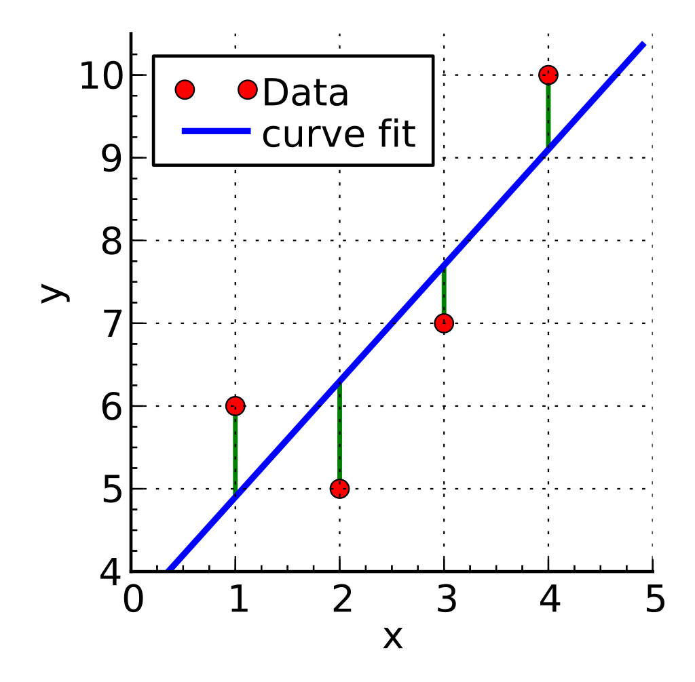

# Machine Learning
These are my personal notes on ML to use as a refresher of the core principles.  
This is a work in progress and imporvement suggestions are very welcome. Let's go!

## Supervised Learning
Training set and valeidation set
labels are ground thruth data used to train a model
3 Types: regression, calssification (binary and multyclass) and ranking.
ML models are trained using features (extracted from training data) and ground truth data (labels). 
The training process consists of fitting a function to the training data to predict the desired outcome, and generalize to new unseen data.

## Unsupervised Learning
In unsupervides learning, models learn patterns exclusevely from unlabeled data.
Such algorithms are clustering ones like k-means, dimensionality reduction, Principal component analysis, autoencoders and Boltzmann Machine Learning.

# Weak or Semi-Supervised Learning
It uses a smal amount of human labeled data followed by a large amnount of unlabeled data.

## Self Supervised Learning
A model is trained on data that is not labeled by humans but already entails some sort of supervisory signal. It leverages inherent structures or relationships to create meaningful signals.

## ML model steps
### Data Splitting
Have training (used to train the model), validation (used for hyperparameter tuning and performance increade) and test (used at the very end) datasets. For example 60, 20, 20 split.
For a fair evaluation of the model and remove chances.  

### Model training
#### Model types
The type of model to use depends on the use case.
For a prediction of a countinuos numerical variable, **linear regression** can be applied.  
Linear Regression consists of solving the following equation:
```math
y = X \cdot w + w_0
```
where X is the training data, where each row is a data point and each column is a feature, $w$ is a vector of weights to be multiplied with each feature, $w_0$ is the bias term.  

  

**Binary classification**: For the prediction of a categorical variable that assumes a value of 0 or 1, **logistic regression** is able to take the result of linea regression and apply a signmoid function mapping values from $-\inf$ and $+\inf$ to 0 or 1, with a threshold of $0.5$ to belong to one class or the other.  
```math
y = \sigma(X \cdot w + w_0)
```
with
```math
\sigma(x) = \frac{1}{1+e^{-x}}
```

- Decision Trees
- Random Forest
- XG Boost
- Neural Network

### Model validation

### Model Evaluation/selection
Once model selected you can combine the training + validation set and train it once more.

### Test the model

