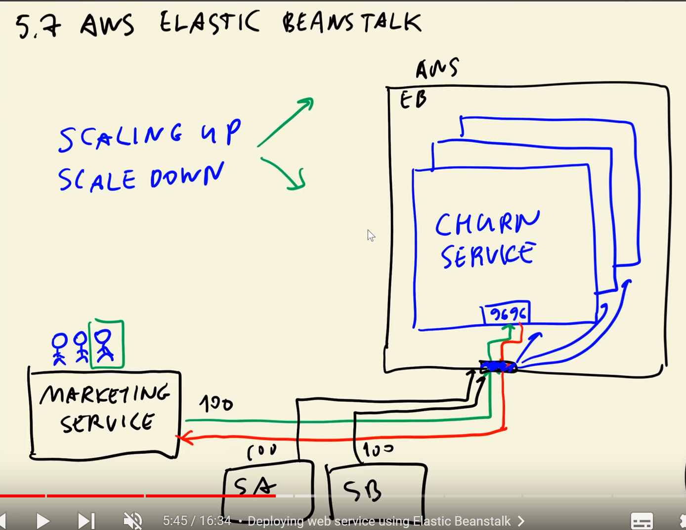

# Cloud Deployment

### Strucutre

A certain service can access via an entrypoint our servie in aws.
The entrypoint is mapped to a docker container running the churn service.
Whenever the demand is high, new containers are created to serve more requests.
Whenever the demand is low the conatiners are shut down.

### Elastic Beanstalk
Install CLI  
``pipenv install awsebcli --dev``
installed using pipenv only on the environemnt we need.

pipenv shell  

pipenv install --dev

