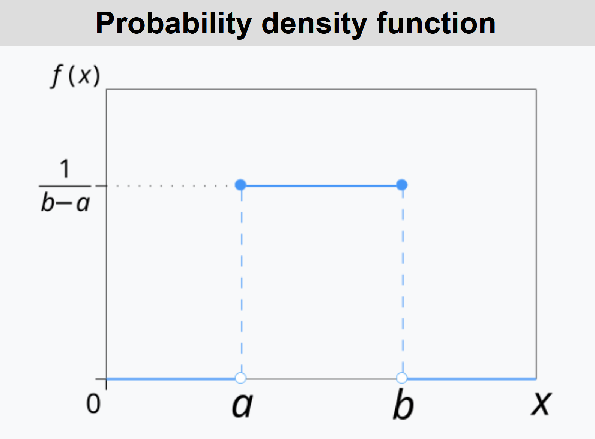

# Statistics Basics

## Definitions:
An **event E** is set of possible values (outcomes) that occur with a certain probability.  
A **random variable X** is a quantity that depends on random events(outcomes) from a sample space.  
A **probabiltiy function P** or random distribution describes the probability $P(X\in E)$ that the event $E$ occurs.  Random
The  **cumulative distribution function** is the probability that a random variable $X$ will take a value less than or equal to $x$.
The **quantile function** is 1 - the cumulative distribution function,, 

## Distributions
A probability distribution is the mathematical function that gives the probabilities of occurrence of possible outcomes for an experiment.

The **Probability Density Function (PDF)** of a continuous random variable is the relative likelihood of the variable to assume a value of the sample space.  

The **Probability Mass Function (PMF)** is the probability that a discrete randome variable assumes a value of the smaple space.  

The integral of these distributions is equal to 1.

### Uniform distributions.
$${\displaystyle f(x)={\begin{cases}{\frac {1}{b-a}}&{\text{for }}a\leq x\leq b,\\[8pt]0&{\text{for }}x<a\ {\text{ or }}\ x>b.\end{cases}}}$$
  

### Gaussian or normal  distributions.
The Gaussian distribution is a probability density fuinction for real valued random variables. The average of many samples of a random variable with finite mean and variance is a random variable and it's distribution converges to a normal distribution.
$${\displaystyle f(x)={\frac {1}{\sqrt {2\pi \sigma ^{2}}}}e^{-{\frac {(x-\mu )^{2}}{2\sigma ^{2}}}}\,.} $$
Why is it special?  Distributions that are an additive superposition of independent variables are normal distributions.

## Standard deviation
Variance $$\sigma^2 = <(x-<x>)^2> = <x^2> - 2 <x>\mu + <\mu^2> = $$
$$ = <x^2> - \mu^2 = <x^2> - <x>^2 $$ 
The standard deviation is a measure of the amount of variation of a variable about its mean.
$$ std = \sigma = \sqrt{ <x^2> - <x>^2} $$
